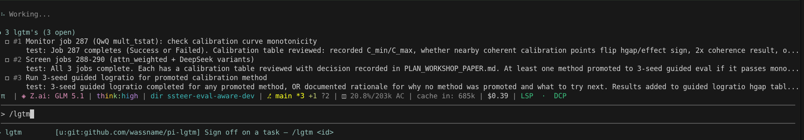

# @wassname/pi-lgtm

Help your agent track goals and aim for human sign off.

A [pi](https://pi.dev) extension that adds structured human sign-off to task tracking. Fork of [@tintinweb/pi-tasks](https://github.com/tintinweb/pi-tasks) with a minimal LGTM layer.

The core idea: agents cannot mark tasks complete themselves. They must call `lgtm_ask` with auditable evidence and explicit failure-mode analysis, then a human signs off via `/lgtm <id>`.

## Install

```bash
pi install npm:@wassname/pi-lgtm
```

Or for development:

```bash
pi -e ./src/index.ts
```



## What is different from pi-tasks

| pi-tasks | pi-lgtm |
|---|---|
| Agent calls `TaskUpdate { status: "completed" }` | Blocked -- throws error |
| No evidence required | `lgtm_ask` requires evidence, 2 failure modes, evidence vs failures |
| Tasks complete immediately | Agent sets `pending_approval`, human runs `/lgtm <id>` |
| No done criterion | `done_criterion` required on create: falsifiable observation |

Stripped: `TaskExecute`, `TaskOutput`, `TaskStop`, `process-tracker.ts`, subagent RPC, settings menu.

## Widget

```
● 3 tasks (1 done, 1 in progress, 1 open)
  ✔ #1 Design schema
  ✳ #2 Implementing cache layer… (2m 49s · ↑ 4.1k ↓ 1.2k)
  ◻ #3 Load test 👀
```

`👀` means the agent called `lgtm_ask` and the task is waiting for human sign-off.

## Tools

### `TaskCreate`

```
subject, description, done_criterion (required), activeForm (optional)
```

`done_criterion` must be a falsifiable observation: what you expect to see AND what you would see if it is wrong. Example: `"All 92 tests pass. If wrong: type errors in build or failures in task-store.test.ts."`

### `TaskList`

Lists all tasks. `👀` indicates pending sign-off.

### `TaskGet`

Full task details including `done_criterion` and approval state.

### `TaskUpdate`

Update status (`pending | in_progress | deleted`), subject, description, done_criterion, dependencies. Cannot set `completed` -- use `/lgtm`.

### `lgtm_ask`

The epistemic gate. Required fields:

| Field | Description |
|---|---|
| `taskId` | Task to submit |
| `evidence` | Exact command run + output, commit hash, config/seeds, file paths. "I ran X and got Y" not "I wrote X". |
| `failure_mode_1` | Most likely way this is wrong despite evidence |
| `failure_mode_2` | Second most likely failure mode |
| `evidence_vs_failures` | How would evidence look different if FM1 or FM2 were true? |
| `evidence_files` | Optional file paths to inspect (validated: must exist) |
| `remaining_uncertainty` | What is NOT tested, deferred edge cases, known limitations |

After calling this, the task shows `👀` and is only completable via `/lgtm <id>`. Evidence is stored on the task so the human can review it hours later without scrolling back.

The tool result includes a non-blocking self-check prompt asking whether the evidence directly addresses the `done_criterion` and whether a skeptical reviewer would find it convincing.

## Commands

### `/lgtm <id>`

Human-only sign-off. Shows stored evidence, failure modes, and remaining uncertainty for review, then asks for confirmation. Without `<id>`, shows a list of pending-approval tasks.

### `/tasks`

Interactive menu: view tasks, create task, clear completed/all.

## Task lifecycle

```
pending -> in_progress -> (lgtm_ask) -> pending_approval 👀 -> (/lgtm) -> completed
                       -> deleted
```

## Storage

Controlled by `taskScope` in `.pi/tasks-config.json`:

| Mode | File | Behaviour |
|---|---|---|
| `memory` | none | In-memory, lost on session end |
| `session` (default) | `.pi/tasks/tasks-<sessionId>.json` | Per-session, survives resume |
| `project` | `.pi/tasks/tasks.json` | Shared across all sessions |

Override via env:

```bash
PI_TASKS=off          # in-memory (CI)
PI_TASKS=sprint-1     # named shared list at ~/.pi/tasks/sprint-1.json
PI_TASKS=/abs/path    # explicit path
PI_TASKS_DEBUG=1      # trace to stderr
```

## Architecture

```
src/
├── index.ts        # 5 tools + /tasks + /lgtm commands + widget + event handlers
├── types.ts        # Task, TaskStatus types
├── task-store.ts   # File-backed store with CRUD, locking, complete() method
├── auto-clear.ts   # Turn-based auto-clearing of completed tasks
├── tasks-config.ts # Config persistence -> .pi/tasks-config.json
└── ui/
    └── task-widget.ts  # Widget with status icons, spinner, 👀 indicator
```

## Development

```bash
npm install
npm run typecheck
npm test            # 92 tests
npm run build
```

## License

MIT -- based on [tintinweb/pi-tasks](https://github.com/tintinweb/pi-tasks) (MIT)
