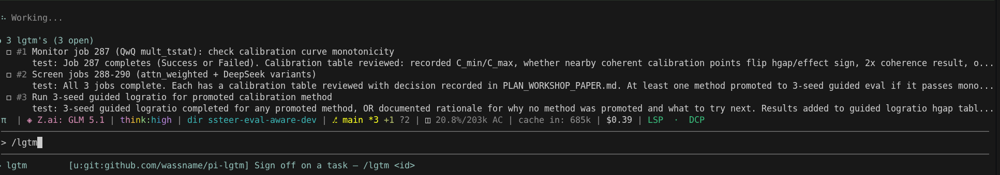
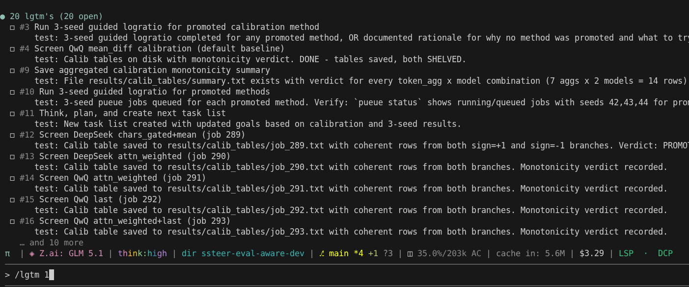

# @wassname2/pi-proof-tasks

Original ask:
> I would like a task list where
> 1) the top level tasks are goals and proof.
> 2) A create_goal that makes the agent think about "what are the most likely, subtle, failure modes and what cheap and easy to review evidence can distinguish between them and goal success".
> 3) A submit_proof form where a subagent provides independant sanity check of on the evidence before completing
> 4) - wassname

Hermes-style evidence + judge task list for Pi.

A [pi](https://pi.dev) extension that adds proof-gated top-level tasks to task tracking. Fork of [@tintinweb/pi-tasks](https://github.com/tintinweb/pi-tasks) with an evidence/review layer inspired by `/until-done`.

The core idea: subtasks are normal checklist items, but top-level tasks are goals. Agents cannot mark top-level tasks complete directly. They must call `TaskClaimDone` with auditable evidence, UAT hints, and explicit failure-mode analysis. A fresh judge then accepts or rejects the claim. Accepted review completes the task; rejected review leaves it open with suggestions.

Humans can use `/lgtm` to view the proof log and sanity-check the reviewer notes later. `/lgtm` is intentionally thin: proof viewing lives there, task management stays in `/tasks`.

## Install

```bash
pi install npm:@wassname2/pi-proof-tasks
```

Or for development:

```bash
pi -e ./src/index.ts
```




## What is different from pi-tasks

| pi-tasks | pi-proof-tasks |
|---|---|
| Agent calls `TaskUpdate { status: "completed" }` on any task | Allowed only for subtasks; top-level tasks reject direct completion |
| No evidence required | `TaskClaimDone` requires evidence, likely/subtle/unknown failures, falsification test, and uncertainty |
| Tasks complete immediately | Top-level tasks complete only after accepted automatic proof review |
| No done criterion | `done_criterion` required on create: falsifiable observation |

Stripped: `TaskExecute`, `TaskOutput`, `TaskStop`, `process-tracker.ts`, subagent RPC, settings menu.

## Widget

```
● 3 tasks (1 done, 1 in progress, 1 open)
  ✔ #1 Design schema
  ✳ #2 Implementing cache layer… (2m 49s · ↑ 4.1k ↓ 1.2k)
  ◻ #3 Load test
```

Collapsed rows stay simple. Proof details live in `TaskGet` and `/lgtm`, not in the widget row itself.

## Tools

### `TaskCreate`

```
subject, description, done_criterion (required), progress_label (optional), parentId (optional)
```

Omit `parentId` for a proof-gated top-level goal. Set `parentId` for a directly tickable subtask.

`done_criterion` must be a falsifiable observation: what you expect to see AND what you would see if it is wrong. Example: `"All 125 tests pass. If wrong: type errors in build or failures in task-store.test.ts."`

### `TaskList`

Lists all tasks in the same compact one-line style as the widget. Proof details live in `TaskGet` and `/lgtm`.

### `TaskGet`

Full task details including `done_criterion`, task kind, `completion mode`, `review state`, gate status, evidence packet, review iterations, and evidence history.

### `TaskUpdate`

Update status (`pending | in_progress | completed | deleted`), subject, description, done_criterion, dependencies, metadata, or `parentId`.

`status=completed` is allowed for subtasks only. Top-level tasks reject with a message telling the agent to use `TaskClaimDone`.

### `TaskClaimDone`

The epistemic gate for proof and UAT. Required fields:

| Field | Description |
|---|---|
| `taskId` | Top-level task to claim done |
| `evidence` | Exact command output, commit hash, config/seeds, file paths. Verbatim proof, not a summary |
| `failure_likely` | Most likely way this is wrong despite evidence |
| `failure_sneaky` | Subtle/silent failure that looks like success superficially |
| `failure_unknown` | Unknown or untested failure class that could remain |
| `falsification_test` | What you ran and what you got, with literal output |
| `evidence_reasoning` | Why this evidence cheaply distinguishes success from the named failures |
| `verification_hints` | Where to look and what to check, with specific content quoted |
| `remaining_uncertainty` | What is NOT tested, deferred edge cases, known limitations |
| `commands` | Optional structured command records: `{ cmd, exit_code, stdout_path?, stderr_path? }` |
| `evidence_paths` / `falsification_paths` | Optional local artifact paths. Stored as absolute path + sha256 + byte size |
| `supersede_reason` | Optional reason when this replaces older evidence on the same task |

The tool stores a compact canonical proof packet. The automatic reviewer sees that exact packet. Humans later see the same packet via `/lgtm`.

If the reviewer accepts, the task is completed. If it rejects, the task remains open with missing evidence and suggestions. If the reviewer fails to run, the task still completes and the failure note is stored in the proof log for later inspection.

### `lgtm_supersede`

Explicitly retire the current evidence package without completing the task.

Use this when the claim changed or the prior evidence is stale. The tool archives the current evidence, current robot reviews, and reviewer-failure context into history with your reason. Submit a fresh `TaskClaimDone` claim to complete the task.

### `robot_review_ask`

Attach a fresh-perspective robot review to a task.

Use this from a separate model/subagent when possible. Reviews append as iterations and are advisory. They do not complete tasks; the automatic gate runs through `TaskClaimDone` or `robot_review_run`.

### `robot_review_run`

Run the automatic robot reviewer against the current task evidence using the current session model.

Default reviewer stage:

```bash
pi --mode json -p --no-session --no-tools --no-extensions --model <current-session-model>
```

The reviewer deliberately reuses the active session model in a fresh Pi process. That keeps model selection simple and avoids choosing a registry-listed judge model that exists but does not have working auth.

The reviewer returns an explicit `accepted` boolean plus observations, concerns, suggestions, blind spots, missing evidence, and rubric reasons. Rejection keeps the task open. Reviewer infrastructure failure is fail-open: autonomy continues and the failure note is stored in the proof log.

## Commands

### `/lgtm`

Proof-log viewer. Use `/lgtm` to pick a task, `/lgtm <id>` to open specific proof logs, and `/lgtm *` to open all open proof logs. It does not complete, delete, or clear tasks.

### `/tasks`

Interactive task-management menu: view tasks, create task, delete a selected task, clear completed, or clear all.

## Task lifecycle

```text
Top-level task:
pending -> in_progress -> TaskClaimDone
                       -> current evidence iteration N 🛠
                       -> robot review iteration(s) 🤖
                       -> completed ✓          if latest robot review accepts
                       -> remains open         if reviewer rejects
                       -> completed            if reviewer infrastructure fails (fail-open, note logged)
                       -> lgtm_supersede or newer TaskClaimDone -> superseded history + fresh current evidence
                       -> deleted

Subtask:
pending -> in_progress -> TaskUpdate(status=completed) -> completed
```

## Storage

Controlled by `taskScope` in `.pi/tasks-config.json`:

| Mode | File | Behaviour |
|---|---|---|
| `memory` | none | In-memory, lost on session end |
| `session` (default) | `.pi/tasks/tasks-<sessionId>.json` | Per-session, survives resume |
| `project` | `.pi/tasks/tasks.json` | Shared across all sessions |

Override via env:

```bash
PI_TASKS=off          # in-memory (CI)
PI_TASKS=sprint-1     # named shared list at ~/.pi/tasks/sprint-1.json
PI_TASKS=/abs/path    # explicit path
PI_TASKS_DEBUG=1      # trace to stderr
```

## Architecture

```text
src/
├── index.ts          # tools + /tasks + /lgtm evidence viewer + widget + event handlers
├── review-badges.ts # Review badge helpers for evidence/review/completion lanes
├── robot-review.ts  # Robot review iteration storage + compatibility helpers
├── types.ts         # Task, TaskStatus types
├── task-store.ts    # File-backed store with CRUD, locking, complete() method
├── auto-clear.ts    # Turn-based auto-clearing of completed tasks
├── tasks-config.ts  # Config persistence -> .pi/tasks-config.json
└── ui/
    └── task-widget.ts  # Widget with status icons and spinner
```

## UI split

- `/tasks` is the management surface.
- `/lgtm` is the proof-log viewer.
- `TaskClaimDone` is the completion gate for top-level tasks.

That split is deliberate. It keeps proof inspection separate from task mutation and stays closer to the simpler pre-fork task UI.

## UAT and development

The intended proof mix is one end-to-end functional test, one live UAT in the extension itself, and only a few targeted unit tests for invariants.

```bash
npm install
npm run typecheck
npm test
npm run build
npm run lint
```

## License

MIT -- based on [tintinweb/pi-tasks](https://github.com/tintinweb/pi-tasks) (MIT)
